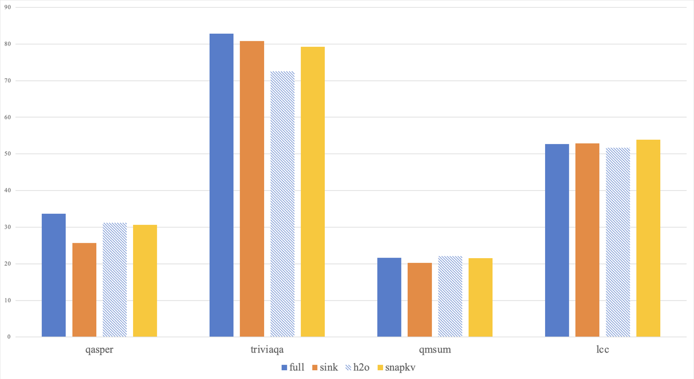

# LLM KV Cache Sparsity

Implement some method of LLM KV Cache Sparsity, including:
1. [Efficient Streaming Language Models with Attention Sinks](http://arxiv.org/abs/2309.17453), also called "SinkCache"
2. [H2O: Heavy-Hitter Oracle for Efficient Generative Inference of Large Language Models](http://arxiv.org/abs/2306.14048)
3. [SnapKV: LLM Knows What You are Looking for Before Generation](http://arxiv.org/abs/2404.14469)

## To Run

```bash
pip install -r requirements.txt
# edit longbench loading method `load_from_disk` in example/test.py
python example/test.py --sparsity_method snapkv
```
The result file will write to `results` folder.

Then you can use `longbench_eval/eval.py` to get the scores.

The **core code** for KV Cache eviction is in `models/kv_clusters.py`

## Results




## Todo

- [x] Sink, H2O, SnapKV
- [ ] [DejaVu](http://arxiv.org/abs/2310.17157)
